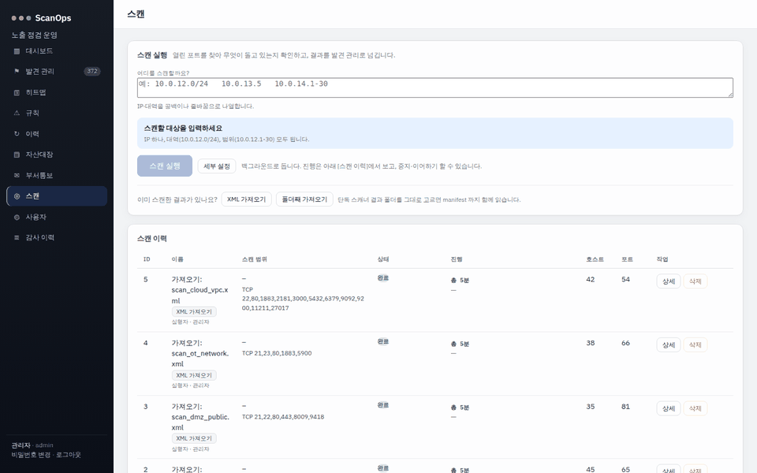
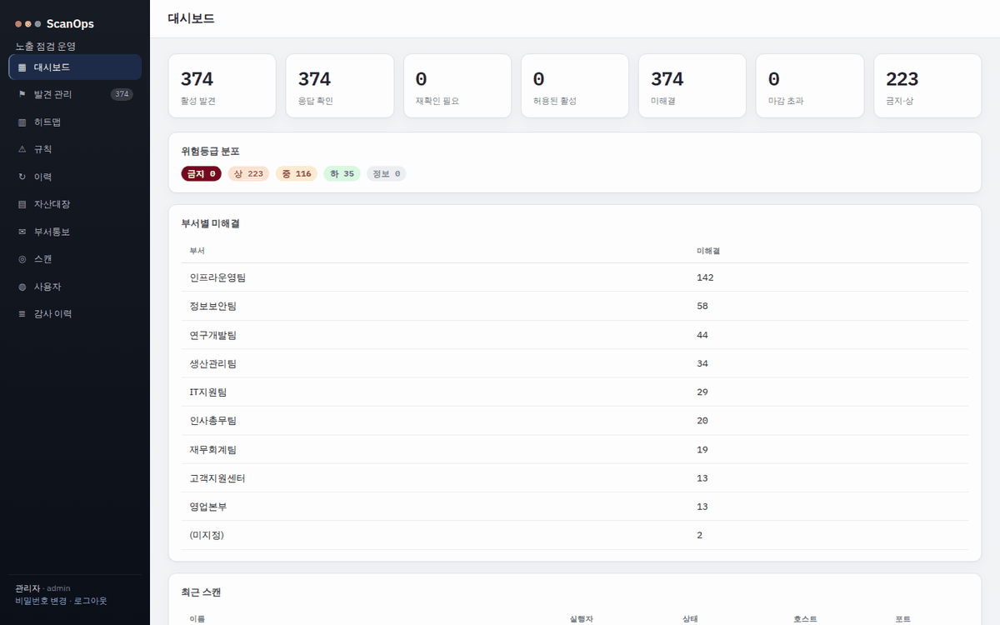
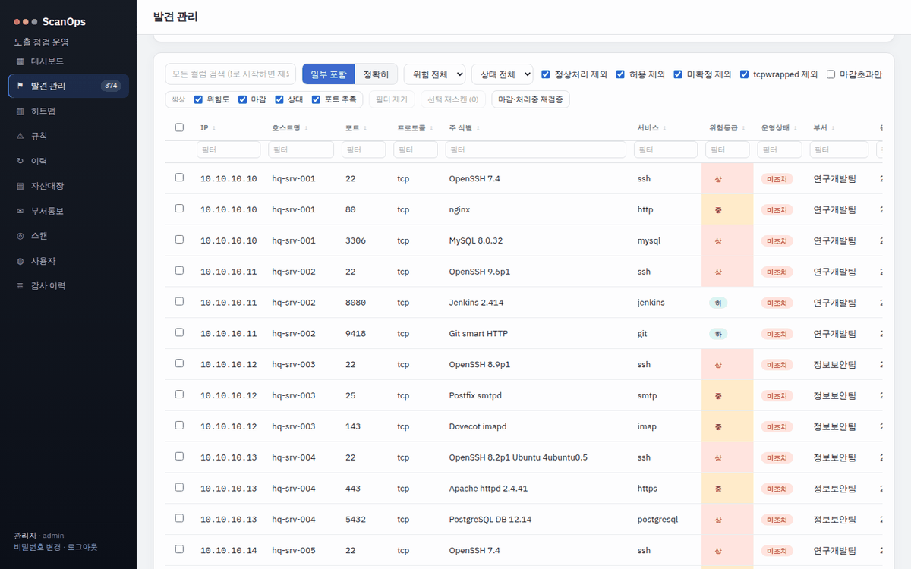
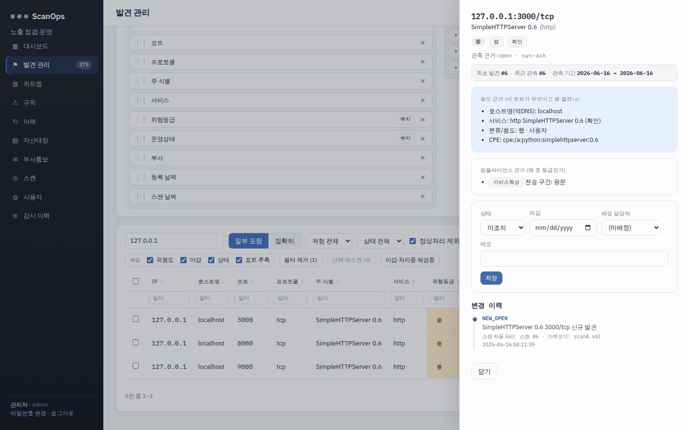
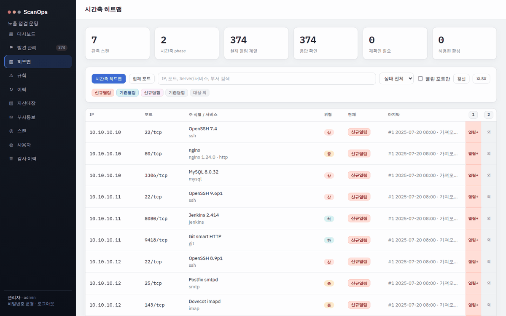
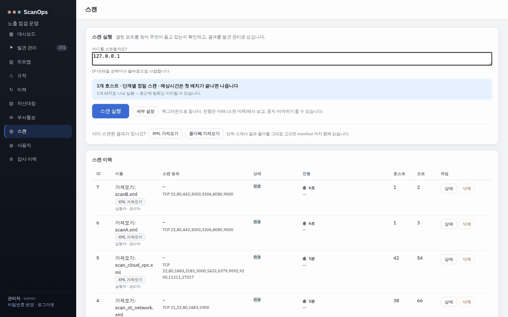
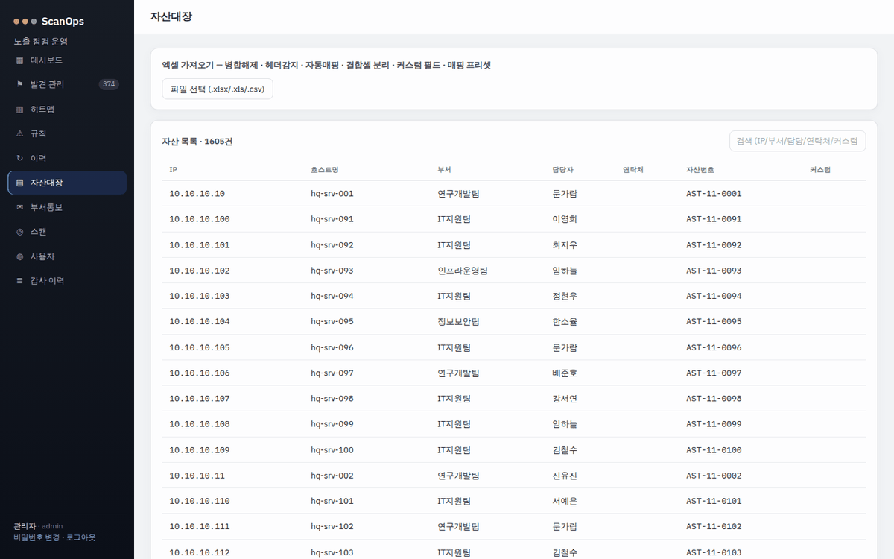
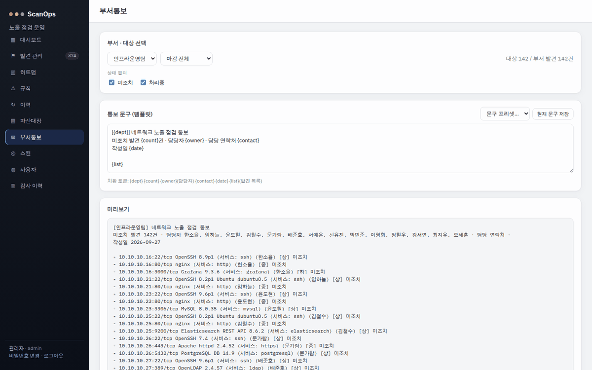
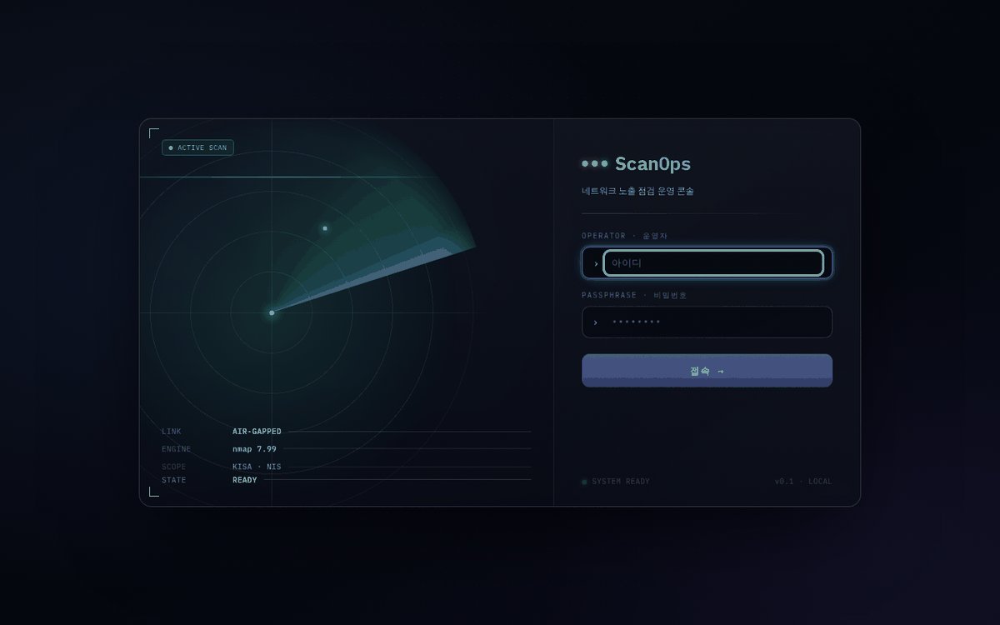

# ScanOps

An in-house network exposure review tool that stores nmap results as individual findings and tracks them from assignment through rescan-based remediation checks to audit reports.

[한국어](README.md) | **English**



The recording above imports `samples/scanA.xml` (ports 3000, 8080 and 9000 open), sets port 3000 to `처리중` (in progress), then imports `samples/scanB.xml`, where port 3000 is closed, and the finding is closed automatically. The rest of the data comes from the synthetic scans and asset ledgers in `test_samples/`. The UI is in Korean.

## Features

| Feature | Description |
|---|---|
| Run scans | Enter target IP (Internet Protocol) addresses or ranges and the server runs nmap. The default is a staged scan (host discovery → TCP (Transmission Control Protocol) port sweep → UDP (User Datagram Protocol) port sweep → service identification) that can be stopped and resumed. |
| Import results | Upload nmap XML (Extensible Markup Language) files produced elsewhere, or a whole result folder from the standalone scanner. |
| Finding management | One finding per port, with status (미조치 open / 처리중 in progress / 정상처리 resolved), deadline and assignee. A column builder changes the table layout; export to CSV (Comma-Separated Values) or XLSX (Excel workbook). |
| Rescan verification | When a later scan shows the port closed, the finding is closed automatically and the event is recorded. Selected findings can be rescanned on their own. |
| Classification and risk | A 105-service taxonomy assigns a risk level plus KISA (Korea Internet & Security Agency) and NIS (National Intelligence Service) references. Organization rules can match on service, product or CPE (Common Platform Enumeration). |
| Timeline heatmap | One table showing, per scan, whether each port newly opened, stayed open or closed. |
| Asset ledger and department notices | Upload an Excel/CSV asset ledger to link findings to departments and owners by IP. Generate and record per-department notice text (nothing is sent externally). |
| Users and audit | Three roles (admin / auditor / viewer), an audit log for logins, scans and rule changes, and an XLSX audit report. |
| Offline install | Copy the wheel bundle and the prebuilt UI to an air-gapped Windows server and install without internet access. |
| Standalone scanner | Run nmap on a scan host with only `scanner/scanops_scanner.py`, then import the results later. |

### Screens

| Dashboard | Findings |
|---|---|
|  |  |
| **Finding detail** | **Timeline heatmap** |
|  |  |
| **Scans** | **Asset ledger** |
|  |  |
| **Department notice** | **Login** |
|  |  |

## Usage

### 1. Requirements

- Python 3.11 or newer (CI (Continuous Integration) tests 3.11 and 3.12)
- nmap (only needed to run scans; XML import works without it)
- Node.js 20.19+ or 22.12+ (only to change the UI or run the dev server; the built UI in `frontend/dist/` is committed)

### 2. Install and run

Linux/macOS:

```bash
cd backend
python -m venv .venv
.venv/bin/python -m pip install -r requirements.txt
.venv/bin/python -m uvicorn scanops.main:app --port 8770
```

Windows (PowerShell):

```powershell
cd backend
python -m venv .venv
.venv\Scripts\python -m pip install -r requirements.txt
.venv\Scripts\python -m uvicorn scanops.main:app --port 8770
```

The backend serves both the API (Application Programming Interface) and the UI on one port. Open `http://127.0.0.1:8770/`. Add `--host 0.0.0.0` to allow access from other machines.

### 3. First login

1. On first start a temporary password for `admin` is written to `data/INITIAL_ADMIN.txt` at the repository root. Set `SCANOPS_DATA_DIR` to use a different data folder.
2. Log in as `admin`; the UI asks you to change the password. The `INITIAL_ADMIN.txt` file is deleted after the change.
3. Create auditor (scan and finding operations) or viewer (read-only) accounts under `사용자` (Users).

### 4. Basic workflow

1. Upload an asset list (xlsx/xls/csv) under **자산대장** (Asset ledger). Findings with the same IP get the department and owner. Examples: `test_samples/assets_*.csv`
2. Under **스캔** (Scans), enter targets and press `스캔 실행` (Run scan), or upload existing results with `XML 가져오기` (Import XML). Examples: `test_samples/scan_*.xml`, `samples/scanA.xml`
3. Under **발견 관리** (Findings), narrow the list with search and filters, then click a row to set status, deadline and assignee.
4. After remediation, rescan (`마감·처리중 재검증`, `선택 재스캔`) or import new results. Closed ports are closed automatically.
5. Review changes in **히트맵** (Heatmap) and **이력** (History), and create notices under **부서통보** (Department notice).
6. Download evidence with `감사 리포트(xlsx) 내보내기` (Export audit report) on the **대시보드** (Dashboard).

To load demo data through the API, start the server, change the admin password, then run the command below. It imports `samples/scanA.xml` and `samples/scanB.xml` in order to produce a remediation check.

```bash
python samples/seed_demo.py <new admin password>
```

### 5. Allowed scan scope

Set `SCANOPS_SCAN_SCOPE` to CIDR (Classless Inter-Domain Routing) ranges or IPs separated by spaces or commas; targets outside the scope are rejected before scanning. Empty means no restriction.

```bash
SCANOPS_SCAN_SCOPE="10.0.0.0/8 192.168.0.0/16" .venv/bin/python -m uvicorn scanops.main:app --port 8770
```

### 6. Offline (air-gapped) deployment

The regular offline ZIP needs **Python 3.13 / 3.12 (x64)**, as required by `install.ps1`, and nmap on the target server.

```powershell
powershell -ExecutionPolicy Bypass -File packaging\install.ps1   # offline install from the wheelhouse
packaging\start.bat                                             # start the server on 0.0.0.0:8770
```

For servers where Python cannot be installed, build an all-in-one ZIP that includes the Python runtime. Unzip it and run `START.bat`.

```powershell
python packaging\build_allinone.py                  # Python 3.13 x64
python packaging\build_allinone.py --python 3.12    # Python 3.12 x64
python packaging\build_allinone.py --arch x86       # Python 3.13 x86
```

Splitting a bundle to fit a file size limit (`--split-mb`), bundle contents and folder-import rules are described in [Operations details](docs/OPERATIONS.md) (Korean).

### 7. Standalone scanner

Copy only `scanner/scanops_scanner.py` to a scan host; it needs Python 3.8+ and nmap.

```bash
python scanner/scanops_scanner.py 10.0.0.10 --ports 22,80,443 --name branch-a
python scanner/scanops_scanner_gui.py
```

Upload the generated `.xml` and `*.manifest.json` files with `스캔 > 폴더째 가져오기` (Scans > Import folder). See [scanner/README.md](scanner/README.md) for all options.

### 8. Tests

```bash
cd backend && python -m pip install -r requirements-dev.txt && python -m pytest -q
cd frontend && npm ci && npm test
```

## Tech stack

| Area | Technology |
|---|---|
| Backend | Python, FastAPI 0.115.6, Uvicorn 0.34.0, SQLAlchemy 2.0.36, Pydantic 2.10.4, pydantic-settings 2.7.1, python-multipart 0.0.20, openpyxl 3.1.5 |
| Database | SQLite (single file, `data/scanops.db`) |
| Frontend | React 18.3.1, Vite 7.3.6, @vitejs/plugin-react 5.2.0, SheetJS (xlsx) 0.20.3 (vendored) |
| Scanning | nmap, staged scan engine in `engine/` (Python standard library only) |
| Standalone scanner | Python 3.8+ standard library, GUI (Graphical User Interface) with tkinter |
| Tests | pytest 8.3.4, httpx 0.28.1, Node.js built-in test runner (`node --test`) |
| Packaging | Windows wheelhouse (CPython 3.12/3.13), embedded-Python all-in-one ZIP, PowerShell install scripts |
| CI | GitHub Actions (`.github/workflows/`) |

## Documentation

- [Progress record](docs/PROGRESS.en.md): final goal, verified feature status, work history
- [Operations details](docs/OPERATIONS.md) (Korean): offline deployment, folder import, result identification, scan performance policy
- [Design](docs/DESIGN.md) (Korean): architecture, data model, API list
- [Staged scan engine](engine/README.md), [Standalone scanner](scanner/README.md), [Validation lab](lab/README.md)
- [Third-party notices](THIRD_PARTY_NOTICES.md)

## License

[MIT License](LICENSE)
